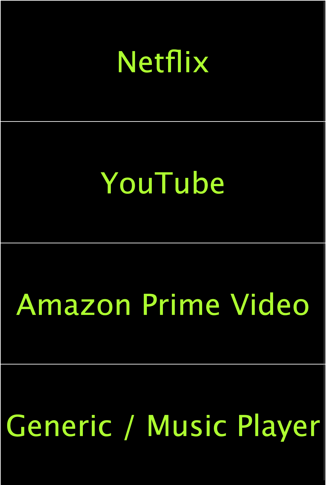

# Remote Control


[](https://www.codacy.com/manual/BrianLusina/remote-control?utm_source=github.com&amp;utm_medium=referral&amp;utm_content=BrianLusina/remote-control&amp;utm_campaign=Badge_Grade)

A basic remote control built with Pug view engine & NodeJS

## Prerequisites

A couple of things you will need:

1. [Node](https://nodejs.org/en/) & [npm](https://www.npmjs.com/) or [yarn](https://yarnpkg.com/)   
    
   Node is necessary to run the current project. NPM or Yarn will be used to install the required dependencies needed by
   this project. 
    
2. [xdotool](https://www.semicomplete.com/projects/xdotool/#installing)
   
   This is necessary to simulate Keyboard & mouse inputs. Depending on your OS architecture, the installation instructions
   in the provided link should be enough to get you started.

## Getting started

Once you have everything above setup, now all you need to do is the following:

Install required dependencies wither with `npm` or with `yarn`

``` bash
npm install
# or
yarn
```

Aftewards, you start the dev server:

```bash
npm start
# or
yarn start
```

You should now see something as below:

|Home Page  | Netflix|  YouTube | Amazon Prime Video | Generic/Music PLayer  |
|---|---|---|---|---|
|   | |   |   |   |

## Built with

1. JavaScript
2. [Pug](https://pugjs.org/api/getting-started.html)
3. [Express](https://expressjs.com/)

[](https://forthebadge.com)
[](https://forthebadge.com)
[](https://forthebadge.com)
[](https://forthebadge.com)
